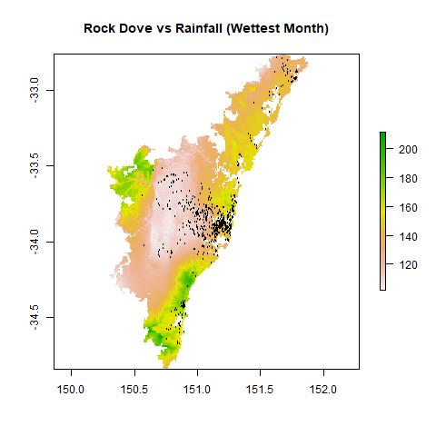

***
# 1.0 Introduction 

Brief introduction 

Aim of the study

specialist and generalists 

## Birds Included in our Study 

***

# 2.0 Methods 

## Preparing the Data

### GIS Processing 

### Cleaning Data in R

## Species Distribution Model in R

### Creating Presence-Absence Data 

### Running a GLM

### Species Suitability Plots 

### Layer Visualisations

***

# 3.0 Results 

## 3.1 Relevant Importance of Factors 

Our code gives three different outputs; the statistical outputs of the GLMs (Table 2), the suitability plots (Section 3.31), and the layer visualisations (Section 3.32). 

After considering the statistical outputs produced by our GLMs (Table 2), we could determine which layers had the greatest influence over species distribution. Across all species, mean annual temperature (Bio1), annual temperature range (Bio7), precipitation seasonality (Bio15), and tree cover were recurring influential variables. We set a maximum p-value of 0.05 to determine significance and looked for t-values with a large absolute value. While each species varied in terms of exact significance values, ‘mean annual temperature’ (Bio1) was the most influential across the board, with the largest t-value and a p-value indicating significance for all species. To some surprise, population density had very little influence on bird distribution for most of our species, with low or no significance. Table 2 summaries some notable statistical outputs.

{width=95%}

We produced a predictive species distribution model, which combines all climate, environmental and human variables used in the GLM to produce a predictive plot of suitability across Greater Sydney for each species (Section 3.31). These plots showed where a given species was most suited to the environment. Influential layer plots allowed us to map individual factors and compare them to species distribution (Section 3.32); this is an excellent way of verifying conclusions. Distribution of individual species in relation to suitability and influential layers is discussed further in the next section.

## 3.2 Species Comparison 

One of the key findings from this analysis is that there is a significant difference between the distributions of specialist and generalist species.

Generalist species, including the noisy miner, rainbow lorikeet, rock dove, and white ibis, all have similar distributions across the Greater Sydney region, occurring in high abundance along the coastal townships and stretching inland through the urban core of Sydney. This includes the northern, eastern and many of the western suburbs of Sydney, including many highly urban and dense suburban regions. Comparing these distributions to our influential layer plots (Section 3.321) shows that generalist species are thriving in areas where mean annual temperature is high and where vegetation is low. The suitability plots (Section 3.311) support this conclusion, showing the highest suitability in the urban core, also extending along the coastal townships to the north and south. This indicates that our generalist species favour heavily urbanised and disturbed environments. 

Our specialist species, including the king parrot, laughing kookaburra, and superb lyrebird, have more specific trends for each species. The suitability plot for the specialist species (Section 3.312) struggled to differentiate the suitability of different regions due to scaling issues, particularly for the king parrot. However, the occurrence points and influential layer plots (Section 3.322) show that the lyrebird and king parrot generally avoid the urban core, and are instead found in areas where the annual temperature range is lowest and where tree cover is highest.  This indicates they prefer natural, stable environments; hence why they occur in coastal and vegetated areas. 

Despite being a specialist species, the laughing kookaburra has a similar distribution to our generalist species, except it extends further inland into less populated and more vegetated regions. Its predictive suitability plot (Section 3.312) supports this trend, though it also shows many occurrences in ‘unsuitable’ environments. This may be an example of data skew due to the species’ iconic nature, or to another feature of the data that makes suitability prediction inappropriate.

Regardless of the difference between specialist and generalist species, climate and tree cover variables were consistently the most influential on population distributions. This is a surprising outcome that demonstrates the importance of species management and monitoring under a changing climate and environment.

## 3.3 Species Plots

### 3.31 Suitability Plots

#### 3.311 Generalist Suitability Plots
{width=45%} {width=45%} {width=45%} {width=45%}

#### 3.312 Specialist Suitability Plots
{width=45%} {width=45%} {width=45%} 

### 3.32 Layer Visualisations 

#### 3.321 Generalist Visualisations

##### White Ibis Influential layers
{width=33%} {width=33%} {width=33%}

##### Noisy Miner Influential layers
{width=33%} {width=33%} {width=33%}

##### Rainbow Lorikeet Influential layers
{width=33%} {width=33%} {width=33%}

##### Rock Dove Influential layers
{width=33%} {width=33%} {width=33%}

#### 3.322 Specialist Visualisations

##### Laughing Kookaburra Influential layers
{width=33%} {width=33%} {width=33%}

##### King Parrot Influential layers
{width=33%} {width=33%} {width=33%}

##### Superb Lyrbird Influential layers
{width=33%} {width=33%} {width=33%}

***

# 4.0 Interpretation and Further Study

As Sydney continues to expand and urbanise, many of the factors that influence bird populations will continue to change. Sydney’s population is expected to increase by over a million people (to around 120% of current levels) by 2041. This is expected to increase both population density and urban sprawl, potentially leading to further loss of tree cover. However, government policies such as urban greening targets may offset some or even all of this impact. Seeing the high impact of climate variables on specialist birds also highlights the need to mitigate the effects of climate change to prevent further disturbance.

This analysis was limited by some confounding factors and preexisting interactions between variables. For example, ALA data is often provided by birdwatchers and citizen scientists, meaning sightings require human activity (and are therefore more likely in areas with dense human populations). Additionally, some variables may have secondary impacts that affect different species to different degrees; for example, a high population density implies the presence of introduced species such as cats, prevalence of non-native vegetation, and acoustic disturbance. All three of these factors might impact different species differently, but cannot at this stage be examined individually. Future studies might use more specific environmental data, splitting these factors up for individual analysis, which would give a much more nuanced picture of what exactly is impacting these species and how best to target future management.

***

# 5.0 Conclusions

By analysing ALA data, we were able to determine that environmental and climatic variables, specifically tree cover, rainfall seasonality, annual mean temperature and temperature range, affect the distribution of bird species across the Sydney Basin. 

These variables impact specialist and generalist species differently. We found generalist species thriving in areas of high disturbance, showing they can live comfortably in areas where urbanisation and climate change are impacting the local environment. However, specialist species strongly favour more ‘natural’ and stable environments. This raises concerns for their continued survival in the Sydney Basin, as urbanisation increases and climate change alters rain and temperature regimes.

Given this knowledge, action needs to be taken to protect specialist birds in Greater Sydney. Further and more detailed research is needed to understand what management strategies would be best to preserve these species in our cities.

You can do the same type of analysis with any group of species, to see how environmental change might be impacting them in your local area. It’s up to you which variables you include in your analysis, and there is plenty more environmental data available online. The options are limitless. By using our code you could find another area that requires management attention. Or you could simply just want to produce some pretty plots. Either way, it's worth a try!
