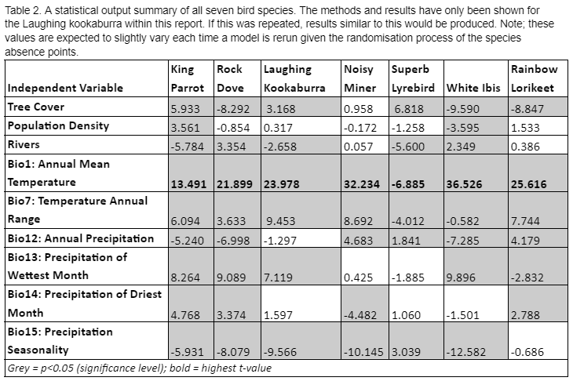

***
# 1.0 Introduction 

Brief introduction 

Aim of the study

specialist and generalists 

## Bird Included in our Study 

***

# 2.0 Methods 

## Preparing the Data

### GIS Processing 

### Cleaning Data in R

## Species Distribution Model in R

### Creating Presence-Absence Data 

### Running a GLM

### Species Suitability Plots 

### Layer Visualisations

***

# 3.0 Results and Interpretations 

## 3.1 Results of Our Analysis 
4 most influential factors
Analysis the plots
- suitability 
- layers 
generalists vs specialists (focus on individual species)

{width=95%}

## 3.2 Plots for all Species

### 3.21 Suitability Plots

#### 3.211 Generalist Suitability Plots
{width=45%} {width=45%} {width=45%} {width=45%}

#### 3.212 Specialist Suitability Plots
{width=45%} {width=45%} {width=45%} 

### 3.22 Layer Visualisations 

#### 3.221 Generalist Visualisations

##### White Ibis Influential layers
{width=33%} {width=33%} {width=33%}

##### Noisy Miner Influential layers
{width=33%} {width=33%} {width=33%}

##### Rainbow Lorikeet Influential layers
{width=33%} {width=33%} {width=33%}

##### Rock Dove Influential layers
{width=33%} {width=33%} {width=33%}

#### 3.222 Specialist Visualisations

##### Laughing Kookaburra Influential layers
{width=33%} {width=33%} {width=33%}

##### King Parrot Influential layers
{width=33%} {width=33%} {width=33%}

##### Superb Lyrbird Influential layers
{width=33%} {width=33%} {width=33%}

## 3.3 Interpretation of results 

***

# 4.0 Conclusions

